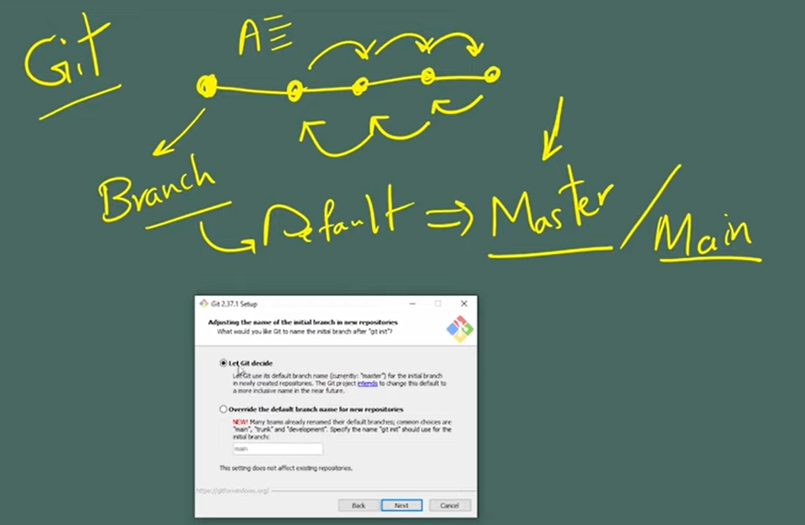

# Git Documentation

## Zlab | Oct 2022

 

> ### Source: [happy-developer youtube Channel](https://www.youtube.com/watch?v=rScUEZPeazY&list=PLG-hncsy5aQ4keIG-pNoGj-zzU7TpFNPR)
> Written by: Mersad Masoud

###  Chapter 1:

مقدمه: گیت یک سیستم کنترل ورژن است(VCS: Version Control System) که توسط [لینوس توروالدز](https://fa.wikipedia.org/wiki/%D9%84%DB%8C%D9%86%D9%88%D8%B3_%D8%AA%D9%88%D8%B1%D9%88%D8%A7%D9%84%D8%AF%D8%B2)، خالق هسته ی لینوکس، توسعه داده شد. لینوس در هنگام توسعه هسته(کرنل) لینوکس با ابزار کنترل ورژن مطرح آن زمان یعنی Bitkeeper مشغول به کار بود که پس از چندی دچار مشکلات متعددی شد، از آنجایی که این برنامه متن باز نبود امکان توسعه و بهبود آن توسط خود لینوکس یا دیگرانی جدای از شرکت مالک وجود نداشت، در نهایت لینوس تصمیم به توسعه سیستم مدیریت ورژن خودش گرفت و آنرا توسعه داد.
 
گیت در حقیقت تاریخچه ای از فایل ها را با توجه به آخرین تغییراتشان همراه با زمان تغییر و تغییردهنده بر روی یک دیتابیس به نام Repository ذخیره می کند، بدین ترتیب در هر زمانی می توان به نسخه ای خاص در گذشته دسترسی داشت و همچنین در کار های تیمی مشخص خواهد بود که چه کسی در چه زمانی چه تغییری بر روی فایل ها ایجاد کرده است و مشارکت بهتری در روند اجرای پروژه حاصل می شود.
 

### Chapter 2:

**دسته بندی VCS ها**

1. Centrilized 
> Like **Subrevision** and **TFS**

2. Decentrilized / Distributed
> Like **Git** and **Mercurial**

به هنگام کار با دسته ی اول با حالتی مواجهیم که در آن یک سرور مرکزی وجود دارد که نسخه ی اصلی کد یا فایل مورد نظر بر روی آن قرار می گیرد و سپس تمام هم تیمی ها و مشارکت کنندگان در پروژه می بایست اطلاعات را از آن سرور گرفته و در نهایت نیز مجددا بر روی آن قرار دهند، در صورتی که این سیستم مرکزی دچار آسیب یا حادثه ای شود دسترسی تمام افراد قطع می گردد! یا در صورتی که کسی اشتباهی مرتکب شود، یا چیزی را که نباید پاک کند، آن محتوا برای همه پاک شده است، و همچنین نسخه ی محلی ای برای اعضا وجود ندارد، در مقابل این استراتژی و اینگونه مشکلات می توان از ساختار های نامتمرکز کنترل ورژن مانند گیت استفاده نمود که در این صورت هر عضو تیم یک نسخه محلی از پروژه را دارد و دیگر یک سرور متمرکز برای نگهداری این تاریخچه تغییرات فایلها و اطلاعات وجود ندارد.

 

**روش های استفاده از گیت**

1. Command line/Terminal (Git bash)
2. Code Editor/IDE (like VS Code)
3. GUI

**دانلود و نصب گیت**

1- جهت دانلود به لینک رسمی خود [گیت](https://git-scm.com/downloads) رفته و نسخه متناسب با سیستم عامل خود را دانلود کرده و سپس فایل دانلود شده را اجرا کنید.

2- به هنگام نصب گیت بش نیز می بایست نصب شود که در حقیقت برای شما یک ترمینال که دستورات یونیکسی را متوجه می شود نصب می کند تا هنگام کار با گیت از طریق کامندلاین از آن استفاده کنید.

3- در قسمتی از مراحل نصب گزینه ی **Let Git Decide** را می بینید که در خصوص این مرحله باید مقداری به مفهوم برنچ یا **Branch** بپردازیم.

**What is a Git Branch?**

اگر نسخه اولیه یک فایل را نسخه صفر در نظر بگیریم به کمک گیت می توان تغییرات اعمال شده بر روی فایل را به صورت خطی ذخیره و دنبال کنیم و هر زمانی که لازم بود از نسخه ی پنجم مثلا به نسخه ی دوم باز گردیم، تمامی این دنباله ی خطی بر روی یک به اصطلاح شاخه یا شعبه پیش فرض شروع به ذخیره سازی می شود که نام آن از ابتدا **Master** بوده است، به دنبال برخی اعتراضات و انتقادات این نام پیش فرض بر روی گیت هاب به **Main** تغییر یافت اما هنوز به صورت رسمی بر روی کل گیت تغییر نکرده است، در این صفحه از مراحل نصب از شما خواسته شده تا انتخاب این نام پیش فرض را یا بر عهده ی خود گیت بگذارید و یا خودتان نام دیگری انتخاب کنید.

در خصوص دلیل وجود شاخه ها و برنچینگ جلوتر مفصل تر بحث خواهد شد.

4- در باقی مراحل بر روی **Next** کلیک کرده تا به این صفحه برسید.

**CRLF ?!**

در اینجا یک نکته ی دیگر در خصوص تنظیمات اولیه گیت با توجه به سیستم عامل مورد استفاده وجود دارد. مسئله اینجاست که بر روی سیستم عامل ویندوز وقتی در انتهای هر خطی از کد یا انتهای فایل **Enter** می زنیم خود برنامه کاراکتر هایی تحت عنوان **line feed (\n)** و **Carriage return (\r)** را در انتهای خط قرار می دهد و در سیستم عامل های یونیکسی مثل لینوکس و مک انتهای خط تنها با **line feed (\n)** مشخص می شود. برای گیت باید تفاوت بین این دو مشخص شود تا گیت بتواند تغییرات فایلها را به صورت خودکار شناسایی کند، اگر مشغول نصب گیت بر روی ویندوز هستید می بایست برای این مورد مقدار **True** انتخاب شود و درغیر این صورت مقدار **Input**.

---
اگه تاحالا چیزی درباره ی CRLF نشنیده بودی و هنوز برات عجیبه و دوست داری بیشتر بدونی این [لینک](https://www.youtube.com/watch?v=TtiBhktB4Qg) برای توعه =)

---

**پایان نصب گیت و فصل دوم**

### Chapter 3

